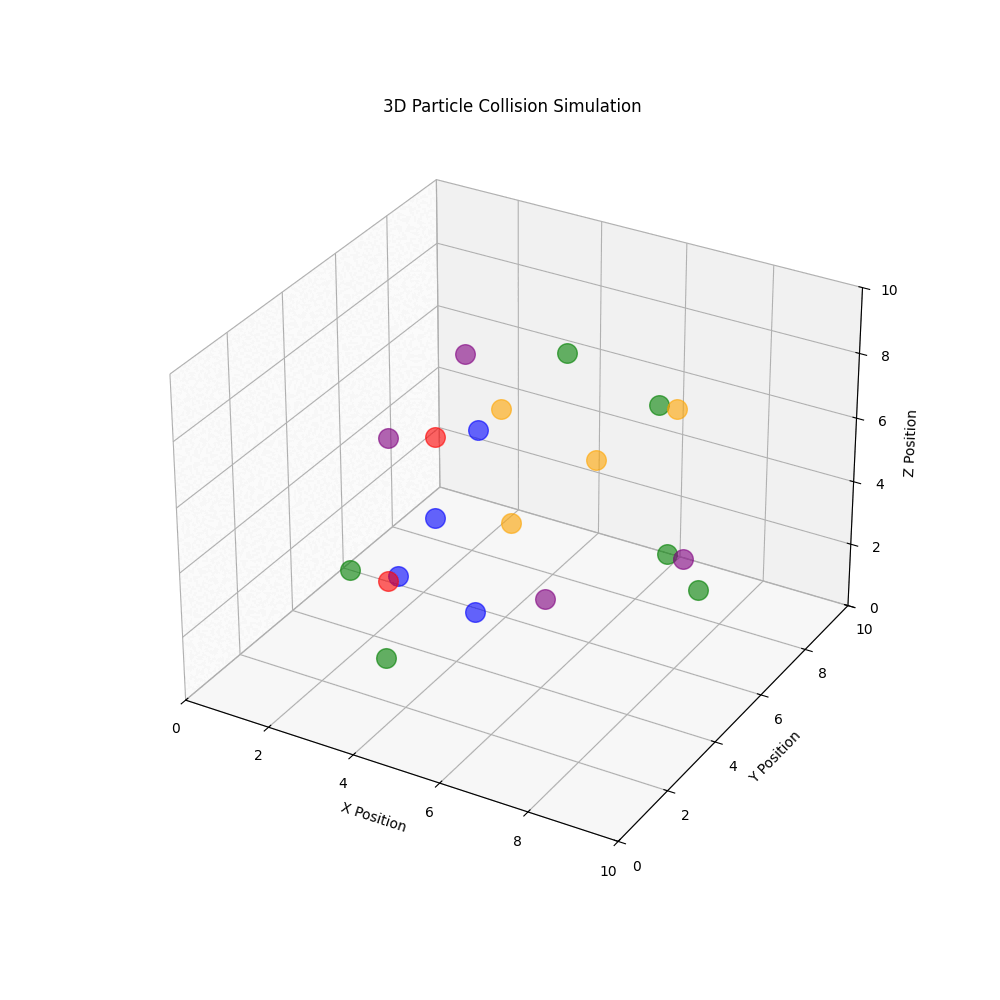

# 3D Particle Collision Simulation

This project simulates the collision of particles in a 3D space, visually representing their movements and interactions over time. The simulation demonstrates basic concepts of particle physics, including motion, collision detection, and response.

## Features

- **3D Visualization**: Particles are represented in a 3D space, allowing for a clear view of their movements and interactions.
- **Collision Detection**: The simulation detects when particles collide and responds by reversing their velocities and creating new particles.
- **Dynamic Simulation**: The positions of particles are updated over time, showing their trajectories and interactions.

## Requirements

- Python 3.x
- NumPy
- Matplotlib
- imageio

## Installation

1. Clone the repository:

   ```bash
   git clone https://github.com/abelard-school-csc/particle-collision-simulation.git
   cd particle-collision-simulation
   ```

2. Install the required packages:

   ```bash
   pip install numpy matplotlib imageio
   ```

## Usage

1. Run the main script to start the simulation:

   ```bash
   python3 main.py
   ```

2. The simulation will generate a GIF file named `particle_collision.gif` in the same directory, displaying the particle interactions over time.

## Example

Below is an example of the output GIF generated by the simulation:



## License

This project is licensed under the MIT License. See the LICENSE file for more details.

## Acknowledgments

Special thanks to my physics teacher for inspiration and guidance throughout this project!
